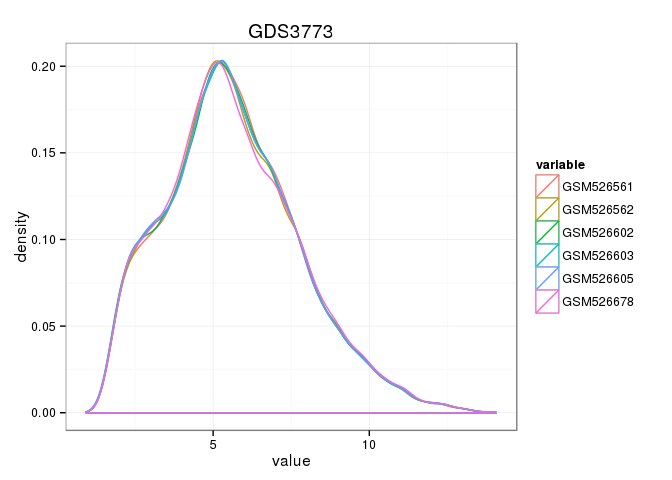
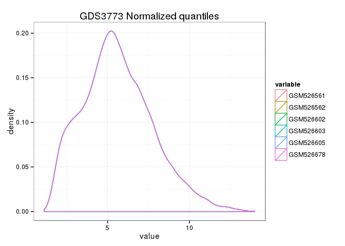
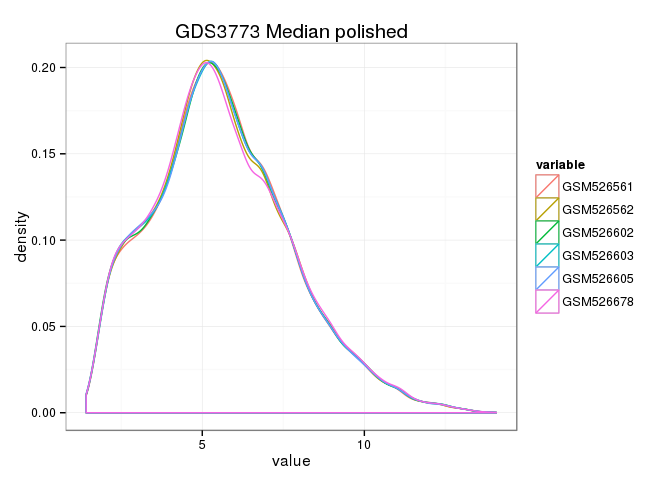
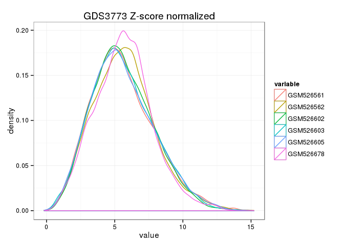

# Data normalization


```r
library(GeoDE)

library(preprocessCore)
library(reshape2)

library(ggplot2)

library(pander)
panderOptions('table.alignment.default', 'left')
panderOptions('table.alignment.rownames', 'left')

source('helpers.R', local=TRUE)
```

## Loading dataset


```r
gds3773 <- get_gds3773()
gds3773_data <- gds3773$data
```

## Basic information:


```r
pandoc.table(gds3773$meta)
```


-------------------------------------------------------------
&nbsp;                         &nbsp;                        
------------------------------ ------------------------------
**platform_organism**          Mus musculus                  

**description**                Analysis of livers from C57BL6
                               males treated with IL-6.      
                               Cytokines such as IL-6        
                               activate STAT3 which plays a  
                               role in glucose homeostasis by
                               negatively regulating hepatic 
                               gluconeogenic gene expression.
                               Results provide insight into  
                               STAT3 targets involved in the 
                               development of metabolic      
                               syndrome.                     

**feature_count**              35557                         

**sample_count**               6                             

**sample_type**                RNA                           

**platform_technology_type**   in situ oligonucleotide       
-------------------------------------------------------------


```r
pandoc.table(gds3773$columns)
```


------------------------------------------------
sample    agent   description                   
--------- ------- ------------------------------
GSM526561 control Value for GSM526561: Saline_1;
                  src: whole liver, treated with
                  saline (control)              

GSM526562 control Value for GSM526562: Saline_2;
                  src: whole liver, treated with
                  saline (control)              

GSM526602 control Value for GSM526602: Saline_3;
                  src: whole liver, treated with
                  saline (control)              

GSM526603 IL-6    Value for GSM526603:          
                  Interleukin_6_1; src: whole   
                  liver, treated with IL-6      

GSM526605 IL-6    Value for GSM526605:          
                  Interleukin_6_2; src: whole   
                  liver, treated with IL-6      

GSM526678 IL-6    Value for GSM526678:          
                  Interleukin_6_3; src: whole   
                  liver, treated with IL-6      
------------------------------------------------


## Plot "raw" data


```r
p <- ggplot(melt(gds3773_data, id.vars = 'IDENTIFIER'), aes(x = value, colour = variable))
p + geom_density(na.rm = TRUE) + theme_bw() + ggtitle('GDS3773')
```

 

## Normalize quantiles


```r
gds3773_data_normalized_quantiles <- gds3773_data
gds3773_data_normalized_quantiles[, -1] <- normalize.quantiles(as.matrix(gds3773_data[, -1]))

p <- ggplot(
    melt(gds3773_data_normalized_quantiles, id.vars = 'IDENTIFIER'), aes(x = value, colour = variable)
)
p + geom_density(na.rm = TRUE) + theme_bw() + ggtitle('GDS3773 Normalized quantiles')
```

 

## Median polish


```r
gds3773_data_median_polished <- gds3773_data
gds3773_data_median_polished[, -1] <- gds3773_data_median_polished[, -1] - {
    mp <- preprocessCore::rcModelMedianPolish(as.matrix(gds3773_data_normalized_quantiles[, -1]))
    mp$Residuals
}

p <- ggplot(
    melt(gds3773_data_median_polished, id.vars = 'IDENTIFIER'), aes(x = value, colour = variable)
)
p + geom_density(na.rm = TRUE) + theme_bw() + ggtitle('GDS3773 Median polished')
```

 

## Z-score normalize


```r
gds3773_z_score_normalized <- gds3773_data
gds3773_z_score_normalized[, -1] <- gds3773_z_score_normalized[, -1] - {
    rowmeans <- apply(gds3773_z_score_normalized[, -1], 1, mean)
    rowstds <- apply(gds3773_z_score_normalized[, -1], 1, sd)
    (gds3773_z_score_normalized[, -1] - rowmeans) / rowstds
}

p <- ggplot(
    melt(gds3773_z_score_normalized, id.vars = 'IDENTIFIER'), aes(x = value, colour = variable)
)
p + geom_density(na.rm = TRUE) + theme_bw() + ggtitle('GDS3773 Z-score normalized')
```

 


1. Ramadoss, P., Chiappini, F., Bilban, M. & Hollenberg, A. N. Regulation of hepatic six transmembrane epithelial antigen of prostate 4 (STEAP4) expression by STAT3 and CCAAT/enhancer-binding protein alpha. J. Biol. Chem. 285, 16453–16466 (2010).
