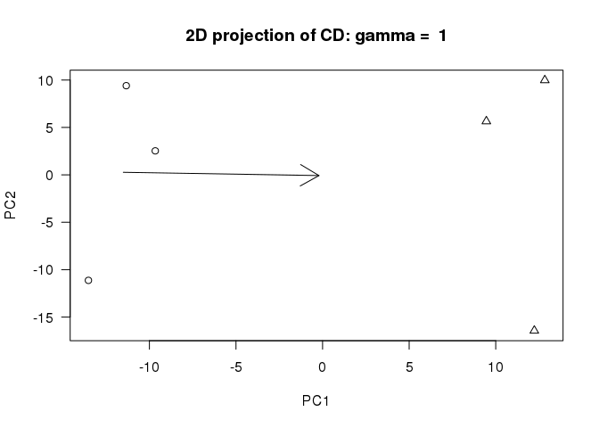
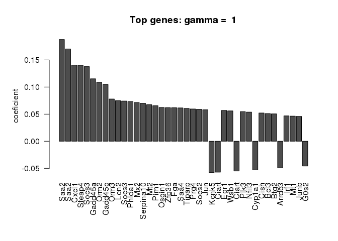

# The Characteristic Direction Method


```r
library(GeoDE)

source('helpers.R', local=TRUE)
```


## Loading dataset


```r
gds3773 <- get_gds3773()
gds3773_data <- gds3773$data
sampleclass <- gds3773$sampleclass
```


```r
gds3773_data <- gds3773_data[!grepl('control|^chr', gds3773_data$IDENTIFIER), ]
cd <- GeoDE::chdirAnalysis(na.omit(gds3773_data), sampleclass, nnull = 1000)
```

  
