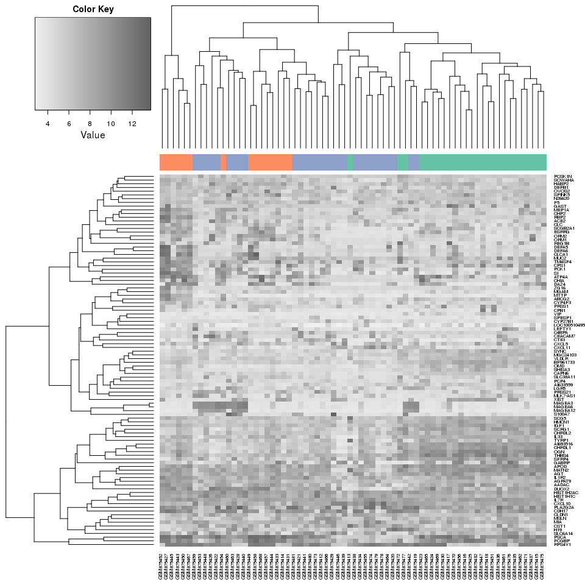

# Hierarchical Clustering


```r
library(gplots)
library(dplyr)

source('helpers.R', local=TRUE)
```

## Load dataset

```r
gds4198 <- get_gds4198()
```

## Perform hierarchical clustering

```r
gds4198_samples_dm <- dist(t(gds4198$data))
gds4198_samples_hc <- hclust(gds4198_samples_dm)
```

## Dendrogram


```r
plot(dendrapply(as.dendrogram(gds4198_samples_hc), color_by_subtype, colnames(gds4198$data), gds4198$subtypes))
title('Dendrogram GDS4198, complete linkage')
```

 

## Heatmap


```r
expr_df <- data.frame(gene = gds4198$genes, gds4198$data) %>% group_by(gene) %>% summarise_each(funs(mean))
expr_df <- expr_df %>% filter(gene %in% top_accross_conditions(expr_df))
expr_matrix <- data.matrix(expr_df[, -1])
rownames(expr_matrix) <- expr_df$gene
heatmap.2(expr_matrix, trace='none', density.info='none', col=colorRampPalette(c('#f0f0f0', '#636363'))(70))
```

 
