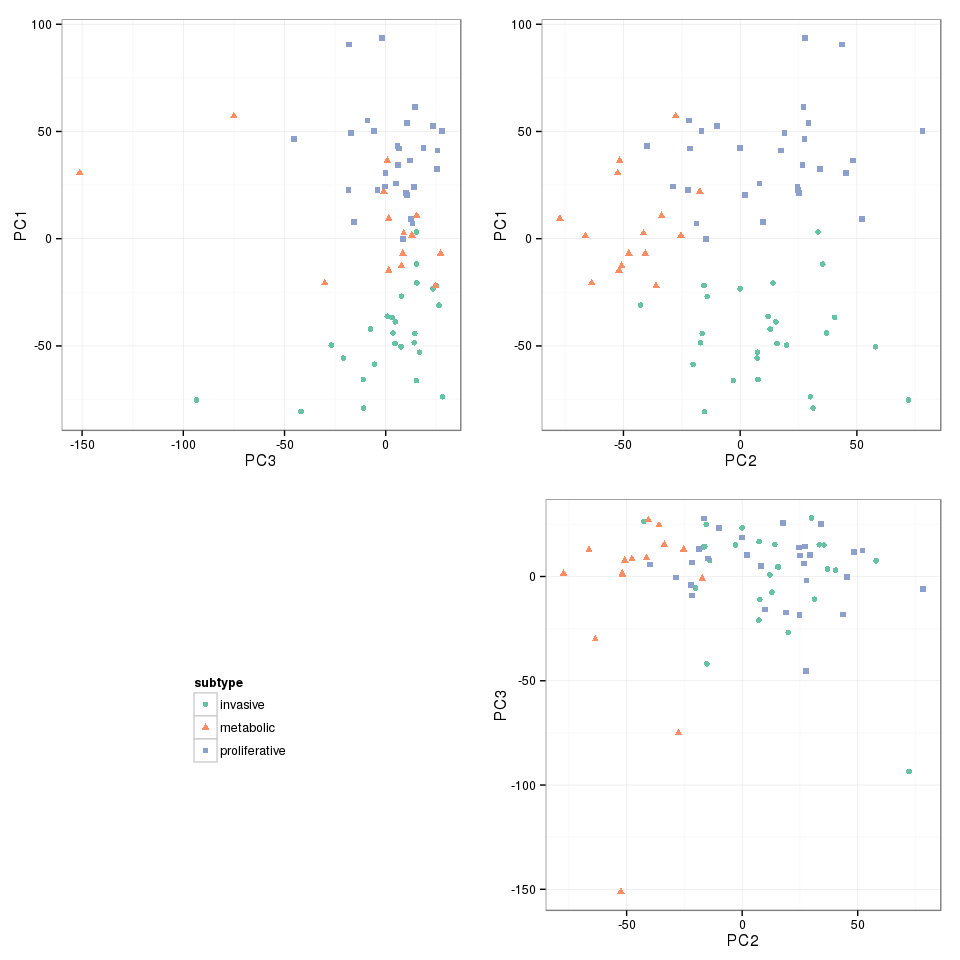

# Principal component analysis


```r
library(ggplot2)
library(gridExtra)

# For get_gds4198 and plot_pc
source('helpers.R', local=TRUE)
```

## Load dataset [1, 2]


```r
gds4198 <- get_gds4198()
```

Dataset contains 70 samples from 3 subtypes (invasive, metabolic, proliferative) of the primary gastric tumors.


## Apply principal component analysis

R `stats` library provides two functions performing principal component analysis: `princomp` and `prcomp`. Since `princomp` requires more observations than variable we'll use `prcomp`.


```r
gds4198_pc <- prcomp(t(gds4198$data))
```

Check percent of variance explained by first 3 prinicpal components.


```r
explained_variance <- (gds4198_pc$sdev) ^ 2 / sum(gds4198_pc$sdev ^ 2) * 100

round(sum(explained_variance[1:3]), 3)
```

```
## [1] 31.065
```

Extract cooridnates of observations in the principal component space and plot first two.


```r
gds4198_pc_x <- as.data.frame(gds4198_pc$x)
gds4198_pc_x$subtype <- gds4198$subtypes

plot_pc(x=gds4198_pc_x, main='GDS4198 - first three principal components')
```

 

1. Wu, Y. et al. Comprehensive genomic meta-analysis identifies intra-tumoural stroma as a predictor of survival in patients with gastric cancer. Gut 62, 1100–1111 (2013).
2. Chia, N.-Y. et al. Regulatory crosstalk between lineage-survival oncogenes KLF5, GATA4 and GATA6 cooperatively promotes gastric cancer development. Gut (2014). doi:10.1136/gutjnl-2013-306596
